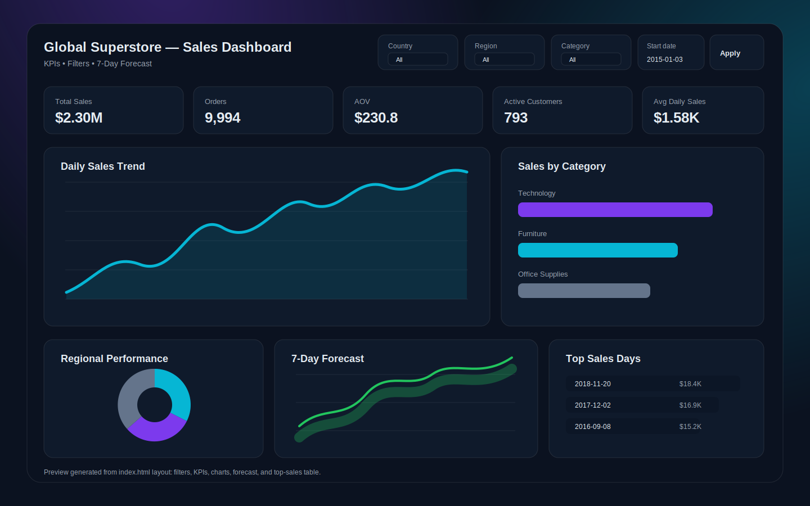

# Superstore Sales Dashboard

An interactive sales analytics dashboard built to explore Superstore performance, track key business metrics, and identify actionable insights across sales, profit, customer segments, categories, regions, and time periods.

## Dashboard Preview



## Project Overview

This project focuses on turning raw Superstore sales data into a clear, business-friendly dashboard that helps stakeholders understand performance trends and make data-driven decisions.

The dashboard is designed to answer questions such as:

- Which regions and segments generate the highest sales and profit?
- Which categories and sub-categories perform best?
- Where are losses happening?
- How do sales and profit change over time?
- What patterns can be used to improve business decisions?

## Key Features

- Sales, profit, quantity, and discount analysis
- Regional and segment-level performance tracking
- Category and sub-category comparison
- Time-based trend analysis
- Identification of high-performing and underperforming areas
- Clean visual storytelling for business users

## Tools Used

- Microsoft Power BI / Tableau / Excel dashboarding workflow
- Data cleaning and transformation
- Data visualization
- Business intelligence analysis

> Note: Update this section with the exact tools used in the project if needed.

## Business Insights

The dashboard helps highlight:

- Top-performing regions, categories, and customer segments
- Products or sub-categories affecting profitability
- Sales trends over time
- Opportunities to reduce losses and improve margins
- Areas where discounting may be impacting profit

## Repository Structure

```text
Superstore-Sales-DashBoard/
├── README.md
├── data/
├── dashboard/
├── images/
│   └── dashboard-preview.svg
└── docs/
```

> The folder structure above is recommended. Add screenshots, source data, and dashboard files to make the repository more complete.

## Recommended Additions

To make this repository stronger and more professional, consider adding:

- Real dashboard screenshots in an `images/` folder
- The final Power BI/Tableau/Excel dashboard file
- A short project summary PDF
- Cleaned dataset or sample dataset
- A data dictionary explaining each column
- A list of final insights and recommendations

## How to Use

1. Clone the repository.
2. Open the dashboard file using the relevant BI tool.
3. Review the visuals and filters.
4. Use the insights section to understand key business findings.

## Project Goal

The main goal of this project is to demonstrate practical business intelligence skills by transforming sales data into a professional dashboard that supports analysis, storytelling, and decision-making.

## Author

**Omar Ahmed**

- GitHub: [OmarDevil](https://github.com/OmarDevil)
- LinkedIn: Add your LinkedIn profile link here
